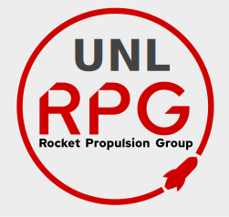
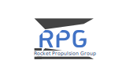

# UNL Rocket Propulsion Group Branding

This repository contains the branding (logos, promotional materials) for the UNL Rocket Propulsion Group.

## Colors

| Color |                                                           | Hex Code    |
|-------|-----------------------------------------------------------|-------------|
| White |  | `#ededed` |
| Black |  | `#000000` |
|  Grey |  | `#434343` |
|  Red  |  | `#d00000` |

## Typography
The fonts used in the logos are [Red Hat Text](https://fonts.google.com/specimen/Red+Hat+Text) and [Radio Canada](https://fonts.google.com/specimen/Radio+Canada).

## Main Logo
### Normal

### Circular

### Small

## Alternate Logo
Technically also the old logo

### With text

### Square

