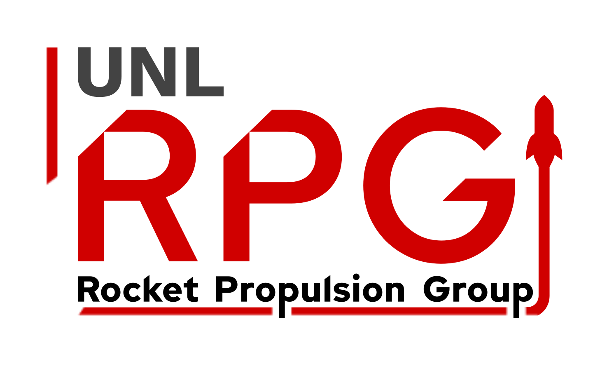

# UNL Rocket Propulsion Group Branding

This repository contains the branding (logos, promotional materials) for the UNL Rocket Propulsion Group.

## Colors

| Color |                                                         | Hex Code  |
|-------|---------------------------------------------------------|-----------|
| White |  | `#ededed` |
| Black |  | `#000000` |
|  Grey |  | `#434343` |
|  Red  |  | `#d00000` |

## Main Logo
### Normal

### Circular

### Small

## Old Logo
### Square

